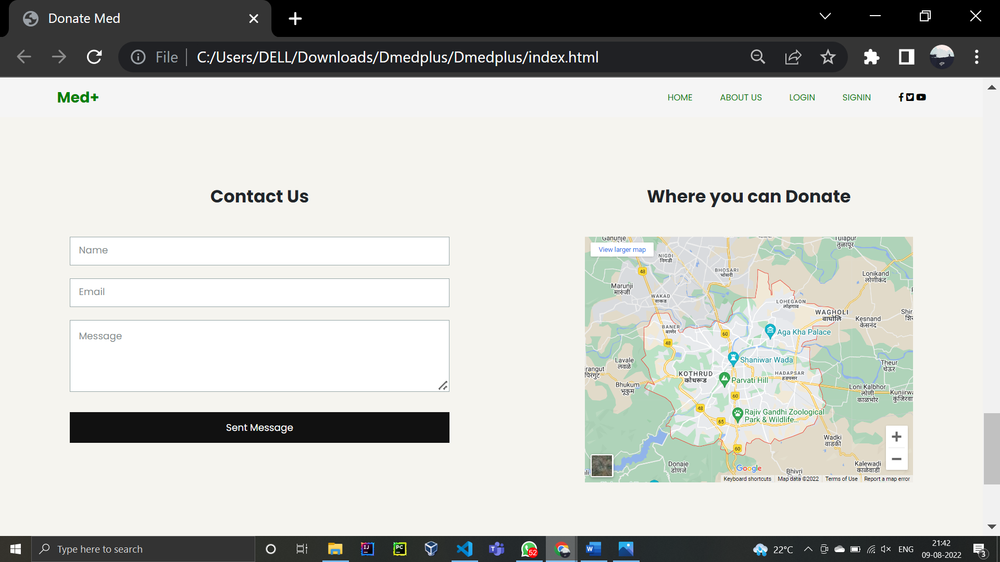

<h2>DMedPlus- Medicine Donation Website</h2>
 

    DMedPlus resembles a virtual exchange center that facilitates users to donate
    their unused medicines. One can either register as a donator or an NGO.
    Donators can choose an NGO of their choice or will be assigned a random one based 
    on their location. NGO will follow up post verification of medicines.

<h3>Features:</h3>
<ul>
    <li>Donating Medicine</li>
    <li>Receiving Medicine</li>
    <li>NGO Registration</li>
</ul>

<h3>Installation:</h3>
<ol>
    <li>Clone the repository. </li>
    <li>Install the XAMPP server in your system </li>
    <li>Launch the control panel of <a href="https://www.apachefriends.org/">XAMPP</a>
        and start <a href="https://www.apache.org/">Apache</a> and <a href="https://www.mysql.com/">MySQL</a> </li>
    <li>Paste this link in any browser to reach the website’s homepage: 
        <a href="localhost/dmedplus/index.html">localhost/dmedplus/index.html</a>
    </li>
</ol>

<h3>Tech Used:</h3>
<ul>
    <b>Frontend:</b>
    <li><a href="https://html.spec.whatwg.org/multipage/">HTML</a></li>
    <li><a href="https://developer.mozilla.org/en-US/docs/Web/CSS">CSS</a></li>
    <li><a href="https://www.javascript.com/">JavaScript</a></li>
    <li><a href="https://getbootstrap.com/">Bootstrap</a> </li> 
    <b>Backend:</b>
    <li><a href="https://www.php.net/">PHP</a></li>
    <li><a href="https://www.mysql.com/">MySQL</a></li>
</ul>

<h3>Snippets:</h3> 

